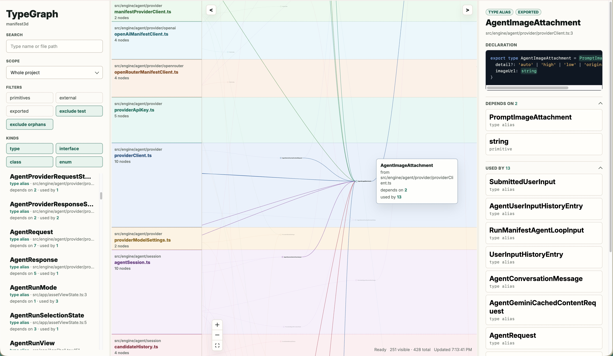

# TypeGraph

TypeGraph explores the TypeScript type structure of a codebase. It parses local projects or public GitHub repositories, discovers type aliases, interfaces, function type aliases, classes/enums where relevant, and builds a navigable type dependency graph that can be inspected in a web GUI or exported as JSON.



## Dev

```sh
npm install
npm run test
npm run lint
npm run typecheck
npm run dev:mock              # index and open GUI on mock codebase inside playground/
npm run dev -- show <path>    # index and open GUI on another TypeScript project
npm run dev -- show <github-repo-url>  # index and open GUI on a public GitHub TS repo
npm run dev -- export <path> --out graph.json  # index and export type graph as json
npm run dev -- export <github-repo-url> --out graph.json
```

## Local CLI Usage

```sh
npm run build
npm link                 # (optional) link tg/typegraph CLI from this repo

npm run start -- show <path>
npm run start -- export <path> --out graph.json
npm run start -- show <github-repo-url>
npm run start -- export <github-repo-url> --out graph.json

# or after linking run:
tg show <path>
tg export <path> --out graph.json
tg show <github-repo-url>
tg export <github-repo-url> --out graph.json
```

**Note:** GitHub targets must be explicit `github.com` URLs. `--project <tsconfig.json>` is only for local filesystem targets.

## Deployed Web App

A deployed version of TypeGraph web app at: https://tg.scottsun.io
Use this directly in browser for any public GitHub TS repos